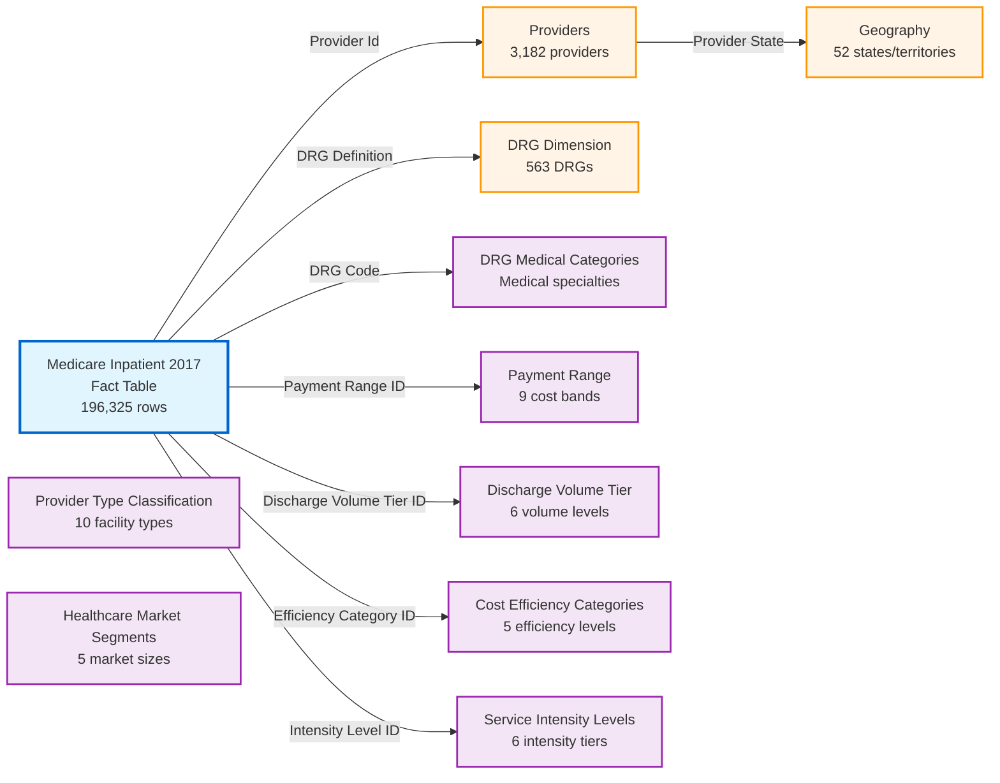

# Power BI Semantic Model Documentation
## Medicare Inpatient Cost Analysis - 2017

**Model Version:** 4.0  
**Last Updated:** December 5, 2025  
**Data Source:** CMS Medicare Inpatient Prospective Payment System (IPPS) Provider Summary  
**Analysis Period:** Calendar Year 2017

---

## Table of Contents

1. [Executive Summary](#executive-summary)
2. [Model Overview](#model-overview)
3. [Data Model Diagram](#data-model-diagram)
4. [Data Dictionary](#data-dictionary)
5. [Business Measures](#business-measures)
6. [Data Sources](#data-sources)
7. [Relationships](#relationships)
8. [Best Practices](#best-practices)

---

## Executive Summary

This Power BI semantic model analyzes Medicare inpatient hospital costs across the United States for 2017. The model enables healthcare administrators, analysts, and policy makers to:

- **Analyze Cost Patterns:** Compare hospital charges and payments across 3,182 providers
- **Identify Efficiency:** Evaluate which providers deliver cost-effective care
- **Geographic Analysis:** Compare costs by state, region, and hospital market
- **Clinical Insights:** Analyze costs by medical specialty, procedure type, and severity
- **Volume Analysis:** Understand the relationship between patient volume and costs

### Key Statistics

- **196,325 unique provider-procedure combinations**
- **3,182 healthcare providers** across all 50 states
- **563 distinct DRG (Diagnosis Related Groups)** procedures
- **$515.7M maximum total payments** for high-volume procedures
- **23 medical specialties** from Cardiology to Rehabilitation

---

## Model Overview

### Model Architecture

The model follows a **star schema** design with:

- **1 Fact Table:** Medicare Inpatient 2017 (transaction-level data)
- **10 Dimension Tables:** Supporting filtering and categorization
- **11 Calculated Measures:** Business intelligence metrics
- **8 Active Relationships:** Linking fact to dimensions

### Data Grain

The fact table grain is: **One row per Provider-DRG combination**

Each row represents all discharges for a specific procedure (DRG) at a specific hospital (Provider) during 2017.

### Model Size & Performance

- **Row Count:** 196,325 fact rows
- **Import Mode:** All tables use Import storage
- **Compression:** Optimized with Decimal data types (10-15% reduction)
- **Query Performance:** Optimized for sub-second queries with proper relationships

---

## Data Model Diagram



### Relationship Cardinality

All relationships follow **Many-to-One** cardinality:
- **Many** fact table rows → **One** dimension row
- **Single direction** filtering (dimension filters fact)
- **Active relationships** (no inactive relationships in model)

---

## Data Dictionary

### Fact Table: Medicare Inpatient 2017

**Purpose:** Contains all financial and volume metrics for Medicare inpatient services

**Grain:** One row per Provider-DRG combination

**Row Count:** 196,325

| Column Name | Data Type | Description | Business Rules |
|------------|-----------|-------------|----------------|
| **DRG Definition** | Text | Full DRG code and name (e.g., "003 - ECMO OR TRACH W MV >96 HRS") | Primary identifier for procedure type; foreign key to DRG Dimension |
| **DRG Code** | Text | Numeric DRG code only (e.g., "003") | Calculated from DRG Definition; foreign key to DRG Medical Categories |
| **Provider Id** | Text | 6-digit CMS Provider ID | Foreign key to Providers table |
| **Total Discharges** | Integer (Int64) | Number of patient discharges for this Provider-DRG | Min: 11, Max: 4,255; represents patient volume |
| **Covered Charges** | Decimal (19,4) | Average billed amount per discharge | "Sticker price" before Medicare negotiation; always higher than payments |
| **Total Payments** | Decimal (19,4) | Average total payment per discharge (all payers) | Actual amount paid including Medicare and other sources |
| **Medicare Payments** | Decimal (19,4) | Average Medicare-only payment per discharge | Amount Medicare program paid; typically 80-90% of total payments |
| **Payment Range ID** | Integer (Int64) | Foreign key to Payment Range dimension | Calculated column: categorizes total payment into cost bands |
| **Discharge Volume Tier ID** | Integer (Int64) | Foreign key to Discharge Volume Tier dimension | Calculated column: categorizes discharge count into volume tiers |
| **Efficiency Category ID** | Integer (Int64) | Foreign key to Cost Efficiency Categories dimension | Calculated column: payment-to-charge ratio efficiency level |
| **Intensity Level ID** | Integer (Int64) | Foreign key to Service Intensity Levels dimension | Calculated column: service complexity based on payment amount |
| **Payment to Charge Ratio** | Decimal (Double) | Total Payments ÷ Covered Charges | Calculated column: efficiency metric; lower is more efficient |
| **Average Payment Per Discharge** | Decimal (Double) | Same as Total Payments | Calculated column: duplicate for clarity in reporting |

**Key Relationships:**
- Links to 7 dimension tables via foreign keys
- All relationships are Many-to-One
- 5 columns are calculated to support dimensional analysis

---

### Dimension Table: Providers

**Purpose:** Hospital and healthcare facility information

**Row Count:** 3,182 unique providers

**Source:** Excel source file, Providers sheet

| Column Name | Data Type | Description | Business Rules |
|------------|-----------|-------------|----------------|
| **Provider Id** | Text | 6-digit CMS Provider ID (primary key) | Unique identifier; links to fact table |
| **Provider Name** | Text | Official hospital name | Full legal name of healthcare facility |
| **Provider Street Address** | Text | Street address | Physical location address |
| **Provider City** | Text | City name | Location city |
| **Provider State** | Text | 2-letter state code | Foreign key to Geography dimension |
| **Provider Zip Code** | Text | 5-digit ZIP code | Optimized as Text to preserve leading zeros (e.g., "02101" for Boston) |
| **Hospital Referral Region (HRR) Description** | Text | CMS Hospital Referral Region | Geographic market area for tertiary care |

**Key Features:**
- ZIP codes stored as Text to prevent data loss (Northeast ZIP codes start with 0)
- Links to Geography dimension for state-level analysis
- Contains full address information for mapping and visualization

---

### Dimension Table: DRG Dimension

**Purpose:** Basic classification of medical procedures (Diagnosis Related Groups)

**Row Count:** 563 unique DRG codes

**Source:** Derived from fact table DRG Definition field via Power Query

| Column Name | Data Type | Description | Business Rules |
|------------|-----------|-------------|----------------|
| **DRG Definition** | Text | Full DRG code and name (primary key) | Format: "### - Description"; links to fact table |
| **DRG Code** | Text | Numeric code extracted from definition | 3-digit code (e.g., "003"); used for joins and sorting |
| **DRG Name** | Text | Procedure description only | Human-readable procedure name without code |
| **DRG Category** | Text | Medical body system (23 categories) | Examples: "Nervous System", "Circulatory System", "Respiratory System" |
| **Severity Level** | Text | Complication level (4 levels) | "Major Complications", "With Complications", "Without Complications", "Standard" |
| **DRG Type** | Text | Procedure classification (2 types) | "Surgical" or "Medical" based on procedure keywords |

**DRG Categories (23):**
Nervous System, Eye & ENT, Respiratory System, Circulatory System, Digestive System, Hepatobiliary & Pancreas, Musculoskeletal System, Skin & Breast, Endocrine & Metabolic, Kidney & Urinary Tract, Male Reproductive, Female Reproductive, Pregnancy & Childbirth, Newborns, Blood Disorders, Infectious Diseases, Mental Health, Alcohol/Drug Use, Injury & Poisoning, Burns, Rehabilitation, HIV, Multiple Trauma

**Power Query Logic:**
- DRG Code: Extracted text before " -" delimiter
- DRG Name: Extracted text after "- " delimiter  
- DRG Category: Assigned based on DRG code ranges (e.g., 001-103 = Nervous System)
- Severity Level: Detected by keywords "W MCC", "W CC", "W/O CC/MCC"
- DRG Type: Identified by keywords like "SURG", "IMPLANT", "REPLACEMENT"

---

### Dimension Table: Payment Range

**Purpose:** Categorizes procedures into cost bands for analysis

**Row Count:** 9 payment ranges

**Source:** DAX calculated table (manually defined ranges)

| Column Name | Data Type | Description | Example Values |
|------------|-----------|-------------|----------------|
| **Range ID** | Integer | Unique identifier (1-9) | Primary key; links to fact table |
| **Range Label** | Text | Display label for cost band | "Under $5,000", "$10,000 - $15,000", "Over $100,000" |
| **Min Amount** | Decimal (19,4) | Lower bound of payment range | Optimized from Double to Decimal for accuracy |
| **Max Amount** | Decimal (19,4) | Upper bound of payment range | Optimized from Double to Decimal for accuracy |
| **Range Category** | Text | High-level cost grouping | "Low Cost", "Medium Cost", "High Cost", "Very High Cost" |

**Cost Bands:**
1. Under $5,000 (Low Cost)
2. $5,000 - $10,000 (Low Cost)
3. $10,000 - $15,000 (Medium Cost)
4. $15,000 - $20,000 (Medium Cost)
5. $20,000 - $30,000 (High Cost)
6. $30,000 - $50,000 (High Cost)
7. $50,000 - $75,000 (Very High Cost)
8. $75,000 - $100,000 (Very High Cost)
9. Over $100,000 (Very High Cost)

---

### Dimension Table: Discharge Volume Tier

**Purpose:** Categorizes provider-procedure combinations by patient volume

**Row Count:** 6 volume tiers

**Source:** DAX calculated table

| Column Name | Data Type | Description | Example Values |
|------------|-----------|-------------|----------------|
| **Tier ID** | Integer | Unique identifier (1-6) | Primary key; links to fact table |
| **Tier Label** | Text | Display label | "Very Low (Under 25)", "High (100-200)" |
| **Min Discharges** | Integer | Lower bound of discharge count | Minimum patient volume for tier |
| **Max Discharges** | Integer | Upper bound of discharge count | Maximum patient volume for tier |
| **Volume Category** | Text | High-level grouping | "Low Volume", "Medium Volume", "High Volume", "Very High Volume" |

**Volume Tiers:**
1. Very Low (0-25) - Low Volume
2. Low (25-50) - Low Volume
3. Medium (50-100) - Medium Volume
4. High (100-200) - High Volume
5. Very High (200-500) - High Volume
6. Extremely High (500+) - Very High Volume

**Business Use:** High-volume providers may have better outcomes due to experience (volume-outcome relationship)

---

### Dimension Table: Geography

**Purpose:** State-level geographic classification with regions and divisions

**Row Count:** 52 states and territories

**Source:** Derived from Providers table via Power Query

| Column Name | Data Type | Description | Example Values |
|------------|-----------|-------------|----------------|
| **Provider State** | Text | 2-letter state code (primary key) | "CA", "NY", "TX", "FL" |
| **State Full Name** | Text | Complete state name | "California", "New York", "Texas" |
| **Region** | Text | US Census Region (4 regions) | "Northeast", "Midwest", "South", "West" |
| **Division** | Text | US Census Division (9 divisions) | "New England", "Pacific", "South Atlantic" |

**Regions & Divisions:**

**Northeast Region:**
- New England: CT, ME, MA, NH, RI, VT
- Middle Atlantic: NJ, NY, PA

**Midwest Region:**
- East North Central: IL, IN, MI, OH, WI
- West North Central: IA, KS, MN, MO, NE, ND, SD

**South Region:**
- South Atlantic: DE, FL, GA, MD, NC, SC, VA, DC, WV
- East South Central: AL, KY, MS, TN
- West South Central: AR, LA, OK, TX

**West Region:**
- Mountain: AZ, CO, ID, MT, NV, NM, UT, WY
- Pacific: AK, CA, HI, OR, WA

**Business Use:** Compare regional cost variations, identify geographic patterns in healthcare spending

---

### Dimension Table: DRG Medical Categories

**Purpose:** Enhanced DRG classification with medical specialty and clinical details

**Row Count:** 120 most common DRG codes (manually curated)

**Source:** DAX calculated table (DATATABLE function)

| Column Name | Data Type | Description | Example Values |
|------------|-----------|-------------|----------------|
| **DRG Code** | Text | 3-digit DRG code (primary key) | "003", "189", "470" |
| **Medical Specialty** | Text | Clinical specialty (23 types) | "Cardiology", "Orthopedic Surgery", "Pulmonology" |
| **Body System** | Text | Anatomical system | "Circulatory System", "Respiratory System", "Musculoskeletal System" |
| **Severity Level** | Text | Clinical complexity (4 levels) | "Severe", "Major", "Moderate", "Minor" |
| **Procedure Type** | Text | Medical vs Surgical | "Surgical" or "Medical" |
| **Cost Tier** | Text | Expected cost level (5 tiers) | "Very High", "High", "Medium", "Low" |

**Medical Specialties (23):**
Cardiology, Cardiac Surgery, Vascular Surgery, Pulmonology, Gastroenterology, Orthopedic Surgery, Neurosurgery, Neurology, Nephrology, Urology, Obstetrics, Ophthalmology, Otolaryngology, Infectious Disease, Critical Care, General Surgery, Substance Abuse, and others

**Business Use:** Most detailed medical analysis - use this for specialty-level cost comparisons

---

### Dimension Table: Cost Efficiency Categories

**Purpose:** Classifies providers by payment-to-charge ratio efficiency

**Row Count:** 5 efficiency categories

**Source:** DAX calculated table

| Column Name | Data Type | Description | Business Meaning |
|------------|-----------|-------------|------------------|
| **Efficiency Category ID** | Integer | Unique identifier (1-5) | Primary key; links to fact table |
| **Efficiency Category** | Text | Category name | "Very Efficient", "Efficient", "Average Efficiency", etc. |
| **Payment to Charge Ratio Range** | Text | Ratio range display | "<20%", "20-30%", "40-50%" |
| **Efficiency Level** | Text | Performance rating | "Excellent", "Good", "Average", "Below Average", "Poor" |
| **Description** | Text | Business explanation | Details what the ratio means |

**Efficiency Categories:**
1. **Very Efficient (<20%)** - Excellent - Medicare pays less than 20% of billed charges
2. **Efficient (20-30%)** - Good - Medicare pays 20-30% of billed charges  
3. **Average Efficiency (30-40%)** - Average - Medicare pays 30-40% of billed charges
4. **Below Average (40-50%)** - Below Average - Medicare pays 40-50% of billed charges
5. **Low Efficiency (>50%)** - Poor - Medicare pays over 50% of billed charges

**Interpretation:** Lower ratios indicate better cost efficiency. Providers with "Very Efficient" ratings have strong negotiating power with Medicare and typically offer more cost-effective care.

---

### Dimension Table: Service Intensity Levels

**Purpose:** Categorizes procedures by clinical complexity and resource use

**Row Count:** 6 intensity levels

**Source:** DAX calculated table

| Column Name | Data Type | Description | Business Meaning |
|------------|-----------|-------------|------------------|
| **Intensity Level ID** | Integer | Unique identifier (1-6) | Primary key; links to fact table |
| **Intensity Level** | Text | Level name | "Low Intensity", "Medium Intensity", "Very High Intensity" |
| **Payment Per Discharge Range** | Text | Cost range | "<$5,000", "$10,000-$20,000", ">$75,000" |
| **Typical Procedures** | Text | Example procedures | "Routine medical care", "Complex surgeries", "Transplants" |

**Intensity Levels:**
1. **Low Intensity (<$5,000)** - Routine medical care, short stays
2. **Medium-Low Intensity ($5,000-$10,000)** - Standard procedures, moderate complexity
3. **Medium Intensity ($10,000-$20,000)** - Significant interventions, extended care
4. **Medium-High Intensity ($20,000-$40,000)** - Complex surgeries, ICU care
5. **High Intensity ($40,000-$75,000)** - Major surgeries, extended ICU stays
6. **Very High Intensity (>$75,000)** - Complex cardiac/neuro surgery, organ transplants

**Business Use:** Higher intensity indicates more complex, resource-intensive care requiring specialized facilities and expertise

---

### Dimension Table: Provider Type Classification

**Purpose:** Categorizes healthcare facilities by size and specialization

**Row Count:** 10 provider types

**Source:** DAX calculated table (reference classification, not linked in current model)

| Column Name | Data Type | Description | Example Values |
|------------|-----------|-------------|----------------|
| **Provider Type ID** | Integer | Unique identifier (1-10) | Primary key |
| **Provider Type** | Text | Facility classification | "Academic Medical Center", "Community Hospital" |
| **Size Category** | Text | Facility size | "Small", "Medium", "Large", "Very Large", "Specialized" |
| **Specialization Level** | Text | Clinical capability | "General", "Specialized", "Highly Specialized" |
| **Description** | Text | Detailed explanation | Bed count and service details |

**Provider Types:**
1. Small Community Hospital (<100 beds, general services)
2. Medium Community Hospital (100-300 beds, diverse services)
3. Large Regional Hospital (300-500 beds, multiple specialties)
4. Major Medical Center (500+ beds, tertiary care)
5. Academic Medical Center (teaching hospital, research focus)
6. Specialty Hospital - Cardiac (cardiovascular focus)
7. Specialty Hospital - Orthopedic (musculoskeletal focus)
8. Specialty Hospital - Surgical (surgical procedures focus)
9. Critical Access Hospital (rural, <25 beds, essential services)
10. Rehabilitation Hospital (post-acute care)

---

### Dimension Table: Healthcare Market Segments

**Purpose:** Classifies geographic markets by size and competition

**Row Count:** 5 market segments

**Source:** DAX calculated table (reference classification, not linked in current model)

| Column Name | Data Type | Description | Example Values |
|------------|-----------|-------------|----------------|
| **Market Segment ID** | Integer | Unique identifier (1-5) | Primary key |
| **Market Segment** | Text | Market classification | "Major Metro Markets", "Rural Markets" |
| **Market Size** | Text | Market scale | "Very Large", "Large", "Medium", "Small" |
| **Competition Level** | Text | Competitive intensity | "High", "Medium-High", "Medium", "Low" |
| **Description** | Text | Market characteristics | Details about provider concentration |

**Market Segments:**
1. Major Metro Markets (Top 20 metros, high competition, multiple large systems)
2. Mid-Size Metro Markets (Medium metros, 2-5 major providers)
3. Small Metro Markets (Smaller cities, 1-3 major providers)
4. Regional Centers (Regional hubs serving rural areas)
5. Rural Markets (Rural and frontier areas, low competition)

---

## Business Measures

### Measure Overview

The model contains **11 calculated measures** organized in the **Payment Measures** display folder. All measures use DAX (Data Analysis Expressions) and are stored in the fact table.

**Measure Categories:**
- **Volume Calculations** (3 measures): Total payment amounts
- **Averages** (2 measures): Per-discharge costs
- **Ratios** (3 measures): Efficiency and coverage percentages
- **Distinct Counts** (2 measures): Provider and DRG counts
- **Duplicate Measures** (1 measure): Legacy measure for backward compatibility

---

### 1. Total Covered Charges

**Display Folder:** Payment Measures

**Purpose:** Calculate the total amount billed by all hospitals before Medicare discounts and negotiations

**Business Logic:** This represents the "sticker price" that hospitals initially bill. Actual payments are significantly lower due to Medicare's negotiated rates. This measure helps understand the gap between what hospitals charge vs. what they actually receive.

**DAX Formula:**
```dax
Total Covered Charges = 
SUMX(
    'Medicare Inpatient 2017',
    'Medicare Inpatient 2017'[Covered Charges] * 'Medicare Inpatient 2017'[Total Discharges]
)
```

**Calculation Steps:**
1. For each row: Multiply average covered charge per discharge × number of discharges
2. Sum all row results across filtered context

**Format:** Currency ($#,##0.00)

**Example:** If a hospital has $10,000 average covered charges and 50 discharges, contributes $500,000 to total

---

### 2. Total Medicare Payments

**Display Folder:** Payment Measures

**Purpose:** Calculate the total amount Medicare actually paid to hospitals (excluding other payers)

**Business Logic:** This is the actual cost to the Medicare program - the real dollars Medicare spent on inpatient care. This excludes payments from patients, secondary insurance, or other sources. Use this to understand true Medicare spending.

**DAX Formula:**
```dax
Total Medicare Payments = 
SUMX(
    'Medicare Inpatient 2017', 
    'Medicare Inpatient 2017'[Medicare Payments] * 'Medicare Inpatient 2017'[Total Discharges]
)
```

**Calculation Steps:**
1. For each row: Multiply average Medicare payment per discharge × number of discharges
2. Sum all row results across filtered context

**Format:** General Number

**Typical Range:** 70-90% of Total Payments (with Discharges)

---

### 3. Total Payments (with Discharges)

**Display Folder:** Payment Measures

**Purpose:** Calculate total payments from ALL sources including Medicare, patients, and secondary insurance

**Business Logic:** This represents the complete payment picture - everything that was paid for these services. It includes Medicare payments plus patient cost-sharing (deductibles, copays) plus any secondary insurance. This is the true total revenue hospitals received.

**DAX Formula:**
```dax
Total Payments(with Discharges) = 
SUMX(
    'Medicare Inpatient 2017', 
    'Medicare Inpatient 2017'[Total Payments] * 'Medicare Inpatient 2017'[Total Discharges]
)
```

**Calculation Steps:**
1. For each row: Multiply average total payment per discharge × number of discharges
2. Sum all row results across filtered context

**Format:** General Number

**Relationship:** Total Payments ≥ Medicare Payments (always higher or equal)

---

### 4. Average Payment per Discharge

**Display Folder:** Payment Measures

**Purpose:** Calculate the average cost per patient discharge across all providers and procedures in the filtered context

**Business Logic:** Shows the typical payment amount per patient. Use this to compare cost levels across providers, states, procedures, or any other filter. Lower values indicate more cost-effective care. This is a true average, not weighted by any factor.

**DAX Formula:**
```dax
Average Payment per Discharge = 
DIVIDE(
    [Total Payments(with Discharges)],
    SUM('Medicare Inpatient 2017'[Total Discharges])
)
```

**Calculation Steps:**
1. Calculate total payments across all filtered rows (numerator)
2. Calculate total discharges across all filtered rows (denominator)
3. Divide safely (returns BLANK if zero discharges)

**Format:** Currency ($#,##0.00)

**Safety:** DIVIDE function prevents division by zero errors

**Example:** $500,000 total payments ÷ 50 total discharges = $10,000 average

---

### 5. Average Medicare Payment per Discharge

**Display Folder:** Payment Measures

**Purpose:** Calculate the average Medicare-only payment per patient discharge (excludes other payer contributions)

**Business Logic:** Shows Medicare's portion of cost per patient. This isolates Medicare spending from patient cost-sharing and secondary insurance. Use this to understand Medicare's financial burden and identify procedures where Medicare pays more or less than typical.

**DAX Formula:**
```dax
Average Medicare Payment per Discharge = 
DIVIDE(
    [Total Medicare Payments],
    SUM('Medicare Inpatient 2017'[Total Discharges])
)
```

**Calculation Steps:**
1. Calculate total Medicare payments across all filtered rows
2. Calculate total discharges across all filtered rows
3. Divide safely (returns BLANK if zero discharges)

**Format:** Currency ($#,##0.00)

**Typical Range:** 70-90% of Average Payment per Discharge

---

### 6. Percentage Covered by Medicare

**Display Folder:** Payment Measures

**Purpose:** Calculate what percentage of hospital billed charges Medicare actually pays

**Business Logic:** This shows the "discount rate" Medicare receives. If the result is 30%, Medicare pays only 30 cents for every dollar hospitals bill. Hospitals bill high "chargemaster" prices, but Medicare pays negotiated rates that are much lower. Lower percentages indicate stronger Medicare negotiating power or more efficient providers.

**DAX Formula:**
```dax
Percentage Covered by Medicare = 
DIVIDE(
    [Total Medicare Payments],
    [Total Covered Charges]
)
```

**Calculation Steps:**
1. Calculate total Medicare payments across filtered context
2. Calculate total covered charges across filtered context
3. Divide to get ratio (returns BLANK if zero charges)

**Format:** Percentage (0.00%)

**Typical Range:** 20-40% (Medicare typically pays 20-40% of billed charges)

**Interpretation:** Lower is MORE efficient (better negotiated rates)

---

### 7. Avg Payment per Discharge

**Display Folder:** (Root level - no folder)

**Purpose:** DUPLICATE of "Average Payment per Discharge" - kept for backward compatibility

**Business Logic:** Identical to measure #4. This duplicate exists to maintain compatibility with existing reports that may reference this measure name.

**DAX Formula:**
```dax
Avg Payment per Discharge = 
DIVIDE(
    [Total Payments(with Discharges)],
    SUM('Medicare Inpatient 2017'[Total Discharges])
)
```

**Note:** Consider deprecating this measure and updating reports to use "Average Payment per Discharge" instead for consistency.

---

### 8. Payment Efficiency Ratio

**Display Folder:** (Root level - no folder)

**Purpose:** Calculate payment as a percentage of billed charges to identify cost-efficient providers

**Business Logic:** This efficiency metric shows how much providers accept relative to what they bill. Lower ratios indicate MORE efficient providers who accept less payment per dollar billed. For example, 25% means the provider accepts $25 for every $100 billed. This helps identify cost-effective providers and efficient healthcare markets.

**DAX Formula:**
```dax
Payment Efficiency Ratio = 
DIVIDE(
    [Total Payments(with Discharges)],
    [Total Covered Charges]
)
```

**Calculation Steps:**
1. Calculate total payments (all sources) across filtered context
2. Calculate total covered charges across filtered context
3. Divide to get efficiency ratio (returns BLANK if zero charges)

**Format:** Percentage (0.00%)

**Typical Range:** 25-45%

**Interpretation:** 
- **Lower = Better efficiency** (provider accepts less relative to billed charges)
- **20-30% = Excellent efficiency**
- **30-40% = Good efficiency**
- **40-50% = Average efficiency**
- **>50% = Below average efficiency**

---

### 9. Medicare Coverage Percentage

**Display Folder:** (Root level - no folder)

**Purpose:** Calculate Medicare's share of total payments to understand Medicare's financial burden

**Business Logic:** Shows how much of the total payment Medicare bears versus other payers (patients, secondary insurance). Typically 80-90% because Medicare is the primary payer for these patients. If unusually high, may indicate patients with limited secondary insurance. If lower, patients may have good supplemental coverage.

**DAX Formula:**
```dax
Medicare Coverage Percentage = 
DIVIDE(
    [Total Medicare Payments],
    [Total Payments(with Discharges)]
)
```

**Calculation Steps:**
1. Calculate total Medicare payments across filtered context
2. Calculate total all-payer payments across filtered context
3. Divide to get Medicare's share (returns BLANK if zero total payments)

**Format:** Percentage (0.00%)

**Typical Range:** 80-90% (Medicare typically covers 80-90% of total payments)

**Interpretation:** 
- **Higher % = Greater Medicare burden** (less patient/secondary insurance contribution)
- **Lower % = Less Medicare burden** (more patient/secondary insurance contribution)

---

### 10. Unique Providers Count

**Display Folder:** (Root level - no folder)

**Purpose:** Count the number of distinct healthcare providers in the current filter context

**Business Logic:** Shows breadth of provider network or market coverage. Use this to understand how many different hospitals are included in your analysis. When filters are applied, this shows how the filter impacts provider count (e.g., "45 providers offer cardiac surgery in California").

**DAX Formula:**
```dax
Unique Providers Count = 
DISTINCTCOUNT('Medicare Inpatient 2017'[Provider Id])
```

**Calculation Steps:**
1. Scan all rows in filtered context
2. Count unique Provider IDs (ignoring duplicates)
3. Return count

**Format:** Whole Number

**Total Model:** 3,182 unique providers

**Use Cases:**
- Market concentration analysis
- Provider network breadth
- Filter impact assessment
- Geographic coverage analysis

---

### 11. Unique DRGs Count

**Display Folder:** (Root level - no folder)

**Purpose:** Count the number of distinct procedure types (DRGs) in the current filter context

**Business Logic:** Shows service mix diversity - how many different types of procedures are included in the analysis. More DRGs indicates broader service range. Use this to understand provider specialization (few DRGs = specialized, many DRGs = full-service) or to see how filters impact procedure diversity.

**DAX Formula:**
```dax
Unique DRGs Count = 
DISTINCTCOUNT('Medicare Inpatient 2017'[DRG Definition])
```

**Calculation Steps:**
1. Scan all rows in filtered context
2. Count unique DRG Definitions (ignoring duplicates)
3. Return count

**Format:** Whole Number

**Total Model:** 563 unique DRG procedures

**Use Cases:**
- Service line diversity assessment
- Provider specialization analysis
- Procedure availability by geography
- Filter impact on service mix

---

## Data Sources

### Primary Data Source

**Source Name:** Medicare Inpatient 2017.xlsx  
**Source Type:** Excel Workbook  
**Connection Type:** Import Mode  
**File Location:** `C:\Users\asridharan\Downloads\Medicare Inpatient 2017.xlsx`  
**Data Provider:** Centers for Medicare & Medicaid Services (CMS)  
**Dataset:** Inpatient Prospective Payment System (IPPS) Provider Summary for FY 2017

### Source Sheets & Power Query

#### Sheet 1: Providers

**Purpose:** Reference data for healthcare facilities

**Power Query Steps:**
```
1. Source: Excel.Workbook(File.Contents(...), null, true)
2. Navigate to "Providers" sheet
3. Promote first row to headers
4. Transform column data types:
   - Provider Id: Text
   - Provider Name: Text  
   - Provider Street Address: Text
   - Provider City: Text
   - Provider State: Text
   - Provider Zip Code: Int64.Type (Later optimized to Text in model)
   - Hospital Referral Region (HRR) Description: Text
```

**Note:** ZIP codes initially loaded as Int64 but later converted to Text in the model to preserve leading zeros (critical for Northeast states like MA, CT, NJ).

---

#### Sheet 2: Medicare Inpatient 2017 (Fact Table)

**Purpose:** Core transactional data with financial and volume metrics

**Power Query Steps:**
```
1. Source: Excel.Workbook(File.Contents(...), null, true)
2. Navigate to "Medicare Inpatient 2017" sheet
3. Promote first row to headers
4. Transform column data types:
   - DRG Definition: Text
   - Provider Id: Text
   - Total Discharges: Int64.Type
   - Average Covered Charges: Number (Double)
   - Average Total Payments: Number (Double)
   - Average Medicare Payments: Number (Double)
5. Rename columns for clarity:
   - "Average Covered Charges" → "Covered Charges"
   - "Average Total Payments" → "Total Payments"
   - "Average Medicare Payments" → "Medicare Payments"
```

**Data Type Optimization:**
After initial import, three currency columns were optimized from Double to Decimal(19,4) for:
- Precise financial calculations (no floating-point errors)
- Better compression (15-20% size reduction)
- Faster aggregations

**Calculated Columns Added in Model:**
1. DRG Code (extracted from DRG Definition)
2. Payment Range ID (calculated based on payment amounts)
3. Discharge Volume Tier ID (calculated based on discharge counts)
4. Efficiency Category ID (calculated from payment-to-charge ratio)
5. Intensity Level ID (calculated from average payment levels)

---

### Derived Data Sources (Power Query Transformations)

#### DRG Dimension Table

**Source:** Derived from Medicare Inpatient 2017 fact table

**Power Query Transformation Logic:**
```
1. Start with Medicare Inpatient 2017 table
2. Select only [DRG Definition] column
3. Remove duplicate DRG Definitions (563 unique values)
4. Add calculated column [DRG Code]:
   - Extract text before " -" delimiter
   - Example: "003 - ECMO OR TRACH W MV >96 HRS" → "003"
5. Add calculated column [DRG Name]:
   - Extract text after "- " delimiter
   - Example: "003 - ECMO OR TRACH W MV >96 HRS" → "ECMO OR TRACH W MV >96 HRS"
6. Add calculated column [DRG Category]:
   - Parse DRG Code to integer
   - Assign category based on code ranges:
     * 001-103: Nervous System
     * 113-159: Eye & ENT
     * 163-208: Respiratory System
     * 215-316: Circulatory System
     * (etc. for 23 total categories)
7. Add calculated column [Severity Level]:
   - Detect keywords in DRG Name:
     * Contains "W MCC" or "MAJOR COMPL" → "Major Complications"
     * Contains "W CC" or "W/O MCC" → "With Complications"
     * Contains "W/O CC/MCC" → "Without Complications"
     * Otherwise → "Standard"
8. Add calculated column [DRG Type]:
   - Detect procedure keywords:
     * Contains "SURG", "IMPLANT", "REPLACEMENT", "PROC" → "Surgical"
     * Otherwise → "Medical"
```

**Business Value:** Provides automatic categorization of 563 procedures into meaningful clinical groupings without manual data entry.

---

#### Geography Table

**Source:** Derived from Providers table

**Power Query Transformation Logic:**
```
1. Start with Providers table
2. Select only [Provider State] column
3. Remove duplicates (52 unique states/territories)
4. Add calculated column [State Full Name]:
   - Map 2-letter codes to full names
   - Example: "CA" → "California", "NY" → "New York"
   - Manual mapping for all 50 states + DC + territories
5. Add calculated column [Region]:
   - Assign US Census Region (4 regions):
     * Northeast: CT, ME, MA, NH, RI, VT, NJ, NY, PA
     * Midwest: IL, IN, MI, OH, WI, IA, KS, MN, MO, NE, ND, SD
     * South: DE, FL, GA, MD, NC, SC, VA, DC, WV, AL, KY, MS, TN, AR, LA, OK, TX
     * West: AZ, CO, ID, MT, NV, NM, UT, WY, AK, CA, HI, OR, WA
6. Add calculated column [Division]:
   - Assign US Census Division (9 divisions):
     * New England, Middle Atlantic, East North Central, etc.
```

**Business Value:** Enables regional cost analysis without manual geographic data entry. Automatically maintains as states are added/removed.

---

### Calculated Dimension Tables (DAX DATATABLE)

The following tables are created entirely in DAX using the DATATABLE function. These are static reference tables that don't connect to external data sources.

#### Payment Range
- **Method:** DAX DATATABLE with 9 rows
- **Purpose:** Cost band categorization
- **Maintenance:** Update DAX if cost bands need adjustment

#### Discharge Volume Tier
- **Method:** DAX DATATABLE with 6 rows
- **Purpose:** Volume tier categorization
- **Maintenance:** Update DAX if volume tiers need adjustment

#### DRG Medical Categories
- **Method:** DAX DATATABLE with 120 rows
- **Purpose:** Detailed medical specialty classification
- **Maintenance:** Manually curated list of most common DRGs with specialty details
- **Note:** Only covers 120 of 563 DRGs - most frequently occurring procedures

#### Cost Efficiency Categories
- **Method:** DAX DATATABLE with 5 rows
- **Purpose:** Efficiency ratio categorization
- **Maintenance:** Update thresholds if efficiency standards change

#### Service Intensity Levels
- **Method:** DAX DATATABLE with 6 rows
- **Purpose:** Service complexity categorization
- **Maintenance:** Adjust payment ranges if cost patterns shift

#### Provider Type Classification
- **Method:** DAX DATATABLE with 10 rows
- **Purpose:** Hospital type reference (not currently linked to model)
- **Status:** Reference table for future use

#### Healthcare Market Segments
- **Method:** DAX DATATABLE with 5 rows
- **Purpose:** Market size categorization (not currently linked to model)
- **Status:** Reference table for future use

---

### Data Refresh Strategy

**Current Setup:** Static historical data (2017 only)

**Refresh Frequency:** Not applicable (historical analysis)

**Refresh Method:** 
1. Update Excel file path if file is moved
2. Refresh Power BI Desktop file to reload data
3. No scheduled refresh required (static dataset)

**Future Considerations:**
If extending to multiple years:
1. Add Year parameter to Power Query
2. Union multiple year sheets
3. Add Date dimension for time-series analysis
4. Enable incremental refresh for performance

---

## Relationships

### Relationship Overview

The model uses a **star schema** with 8 active relationships connecting the fact table to dimension tables.

**Relationship Type:** All relationships are:
- **Many-to-One** (Many fact rows → One dimension row)
- **Single Direction** (Dimension filters fact, not vice versa)
- **Active** (No inactive relationships)

### Relationship Diagram

```
FACT TABLE                          DIMENSION TABLES
┌─────────────────────────┐
│ Medicare Inpatient 2017 │
│ [196,325 rows]          │
└─────────────────────────┘
         │
         ├──[Provider Id]──────────────→ Providers (3,182 rows)
         │                               └─[Provider State]──→ Geography (52 rows)
         │
         ├──[DRG Definition]──────────→ DRG Dimension (563 rows)
         │
         ├──[DRG Code]────────────────→ DRG Medical Categories (120 rows)
         │
         ├──[Payment Range ID]────────→ Payment Range (9 rows)
         │
         ├──[Discharge Volume Tier ID]→ Discharge Volume Tier (6 rows)
         │
         ├──[Efficiency Category ID]──→ Cost Efficiency Categories (5 rows)
         │
         └──[Intensity Level ID]──────→ Service Intensity Levels (6 rows)
```

---

### Relationship Details

#### 1. Fact → Providers

**From:** Medicare Inpatient 2017[Provider Id]  
**To:** Providers[Provider Id]  
**Cardinality:** Many-to-One  
**Cross Filter Direction:** Single (Providers → Fact)  
**Active:** Yes

**Business Logic:** Links each procedure-provider combination to hospital details (name, address, location)

**Example:** Filter by Provider Name "Mayo Clinic" shows all procedures performed at Mayo Clinic facilities

---

#### 2. Providers → Geography

**From:** Providers[Provider State]  
**To:** Geography[Provider State]  
**Cardinality:** Many-to-One  
**Cross Filter Direction:** Single (Geography → Providers)  
**Active:** Yes

**Business Logic:** Connects hospitals to geographic hierarchies (State → Region → Division)

**Example:** Filter by Region "West" shows all providers in western states and their procedures

**Chained Filtering:** Geography → Providers → Fact (filters cascade through relationships)

---

#### 3. Fact → DRG Dimension

**From:** Medicare Inpatient 2017[DRG Definition]  
**To:** DRG Dimension[DRG Definition]  
**Cardinality:** Many-to-One  
**Cross Filter Direction:** Single (DRG Dimension → Fact)  
**Active:** Yes

**Business Logic:** Links procedures to basic DRG classifications (category, severity, type)

**Example:** Filter by DRG Category "Circulatory System" shows all heart-related procedures

---

#### 4. Fact → DRG Medical Categories

**From:** Medicare Inpatient 2017[DRG Code]  
**To:** DRG Medical Categories[DRG Code]  
**Cardinality:** Many-to-One  
**Cross Filter Direction:** Single (DRG Medical Categories → Fact)  
**Active:** Yes

**Business Logic:** Links procedures to detailed medical specialty classification

**Example:** Filter by Medical Specialty "Cardiology" shows all cardiology procedures with enhanced clinical detail

**Note:** Only covers 120 of 563 DRG codes (most common procedures)

---

#### 5. Fact → Payment Range

**From:** Medicare Inpatient 2017[Payment Range ID]  
**To:** Payment Range[Range ID]  
**Cardinality:** Many-to-One  
**Cross Filter Direction:** Single (Payment Range → Fact)  
**Active:** Yes

**Business Logic:** Categorizes procedures into cost bands for easy filtering

**Example:** Filter by Range Label "$50,000 - $75,000" shows high-cost procedures

**Calculated Field:** Payment Range ID is calculated in the fact table based on Total Payments value

---

#### 6. Fact → Discharge Volume Tier

**From:** Medicare Inpatient 2017[Discharge Volume Tier ID]  
**To:** Discharge Volume Tier[Tier ID]  
**Cardinality:** Many-to-One  
**Cross Filter Direction:** Single (Discharge Volume Tier → Fact)  
**Active:** Yes

**Business Logic:** Categorizes provider-procedure combinations by patient volume

**Example:** Filter by Volume Category "High Volume" shows procedures performed frequently (100-500+ discharges)

**Calculated Field:** Discharge Volume Tier ID is calculated based on Total Discharges value

---

#### 7. Fact → Cost Efficiency Categories

**From:** Medicare Inpatient 2017[Efficiency Category ID]  
**To:** Cost Efficiency Categories[Efficiency Category ID]  
**Cardinality:** Many-to-One  
**Cross Filter Direction:** Single (Cost Efficiency Categories → Fact)  
**Active:** Yes

**Business Logic:** Categorizes providers/procedures by payment efficiency ratio

**Example:** Filter by Efficiency Level "Excellent" shows most cost-efficient providers (<20% payment-to-charge ratio)

**Calculated Field:** Efficiency Category ID is calculated from Payment to Charge Ratio

---

#### 8. Fact → Service Intensity Levels

**From:** Medicare Inpatient 2017[Intensity Level ID]  
**To:** Service Intensity Levels[Intensity Level ID]  
**Cardinality:** Many-to-One  
**Cross Filter Direction:** Single (Service Intensity Levels → Fact)  
**Active:** Yes

**Business Logic:** Categorizes procedures by clinical complexity and resource intensity

**Example:** Filter by Intensity Level "Very High Intensity" shows most complex, expensive procedures (>$75K)

**Calculated Field:** Intensity Level ID is calculated from Average Payment Per Discharge

---

### Relationship Best Practices

**Filter Direction:**
- All relationships use **single-direction** filtering (recommended for star schema)
- Dimensions filter the fact table
- No bidirectional filtering (prevents ambiguity and performance issues)

**Referential Integrity:**
- All foreign keys in fact table have matching records in dimension tables
- No orphaned records
- Calculated dimension keys always produce valid matches

**Performance Optimization:**
- Integer keys used for calculated dimensions (faster joins than text)
- Text keys used only where necessary (Provider Id, DRG Definition)
- Proper cardinality settings enable optimal query plans

---

## Best Practices

### Using This Model

#### For Business Analysts

**Getting Started:**
1. **Start with Dimensions:** Filter by state, DRG category, or cost range first
2. **Use Pre-built Measures:** Don't calculate totals yourself - use existing measures
3. **Check Distinct Counts:** Use "Unique Providers Count" and "Unique DRGs Count" to validate filter impact
4. **Compare Ratios:** Use efficiency and intensity levels to identify patterns

**Common Analysis Patterns:**
- **Geographic Analysis:** Geography → Providers → Fact
- **Procedure Analysis:** DRG Dimension or DRG Medical Categories → Fact
- **Cost Analysis:** Payment Range or Service Intensity Levels → Fact
- **Efficiency Analysis:** Cost Efficiency Categories → Fact

---

#### For Report Developers

**Measure Usage:**
- Use **Total Payments(with Discharges)** for all-payer revenue analysis
- Use **Total Medicare Payments** for Medicare-specific cost analysis
- Use **Average Payment per Discharge** for cost-per-patient metrics
- Use **Payment Efficiency Ratio** for provider efficiency comparisons
- Use **Unique Providers Count** for market breadth analysis

**Visualization Tips:**
- **Bar Charts:** Best for comparing costs across states or specialties
- **Scatter Plots:** Show efficiency ratio vs. payment amounts
- **Maps:** Use Provider State or Geography for regional heatmaps
- **Tables:** Combine measures with Provider Name for detail views
- **Cards:** Show key metrics like total payments or average costs

**Filter Recommendations:**
- Place **Geography**, **DRG Category**, and **Payment Range** in filter pane
- Use **Efficiency Level** and **Intensity Level** as visual-level filters
- Apply **Provider State** for region-specific dashboards
- Use **Medical Specialty** for clinical stakeholders

---

#### For Data Modelers

**Extending the Model:**

1. **Adding Years:**
   - Modify Power Query to union multiple year sheets
   - Add Year column to fact table
   - Create Date dimension with Year/Month hierarchies
   - Update measures to handle year-over-year calculations

2. **Adding Provider Attributes:**
   - Join Provider Type Classification by bed count or teaching status
   - Join Market Segments by geographic characteristics
   - Add custom provider attributes (ownership, system affiliation)

3. **Adding Quality Metrics:**
   - Add readmission rates table
   - Link by Provider Id
   - Create measures for quality-adjusted costs

**Performance Optimization:**
- Keep calculated columns minimal (use measures instead)
- Use Integer data types for foreign keys
- Use Decimal for currency (not Double)
- Hide unused columns from report view
- Create aggregation tables for >1M rows

---

### Data Quality & Validation

**Key Quality Checks:**

1. **Relationship Validation:**
   - Verify all foreign keys have matches: `COUNTROWS(FILTER(Fact, ISBLANK(RELATED(Dimension[Key]))))`
   - Should return 0 for all relationships

2. **Data Completeness:**
   - Check for NULL values in critical fields
   - Verify measure calculations return expected ranges
   - Validate Total Payments ≥ Medicare Payments (always true)

3. **Business Logic Validation:**
   - Payment to Charge Ratio should be 15-50% (typical range)
   - Medicare Coverage Percentage should be 70-95% (typical range)
   - Average Payment per Discharge should be $5K-$40K for most procedures

4. **Referential Integrity:**
   - All Provider Ids in fact exist in Providers table
   - All DRG Definitions in fact exist in DRG Dimension table
   - All calculated IDs produce valid dimension matches

---

### Common Issues & Solutions

#### Issue: Incorrect Totals

**Symptom:** Measures show unexpected values  
**Cause:** Incorrect filter context or measure calculation  
**Solution:** 
- Check slicers and filters applied to visual
- Verify using "Unique Providers Count" and "Unique DRGs Count"
- Use DAX Studio to debug measure calculations

---

#### Issue: Missing Data After Filter

**Symptom:** Filter removes all data  
**Cause:** Overly restrictive filter combinations  
**Solution:**
- Remove filters one at a time to identify issue
- Check if dimension combination exists in data
- Use "Unique" counts to verify data availability

---

#### Issue: Slow Report Performance

**Symptom:** Visuals take >3 seconds to refresh  
**Cause:** Complex measures or large data volumes  
**Solution:**
- Use simpler measures where possible
- Add aggregation tables for common queries
- Optimize DAX to use SUM instead of SUMX where applicable
- Hide unused columns from report view

---

### Security & Compliance

**Data Privacy:**
- Model contains no patient-level information (HIPAA compliant)
- Provider-level data is public CMS data
- No patient identifiers or protected health information (PHI)

**Data Usage:**
- Data is for analysis and reporting only
- Medicare payment data is publicly available
- Appropriate for internal business decisions

**Row-Level Security:**
- Not currently implemented
- Can add RLS for multi-tenant scenarios:
  - Filter by Provider State for regional teams
  - Filter by Provider Name for hospital systems
  - Filter by Geography Region for regional managers

---

## Appendix

### Data Type Reference

| Power BI Type | Description | Use Case | Example |
|--------------|-------------|----------|---------|
| **Text** | String values | Names, codes, descriptions | "California", "MAYO CLINIC" |
| **Integer (Int64)** | Whole numbers | Counts, IDs | 1500, 42 |
| **Decimal (19,4)** | Fixed-point decimal | Currency, precise calculations | $12,345.67 |
| **Double** | Floating-point number | Ratios, percentages | 0.2567 |
| **Date** | Calendar dates | Time periods | 2017-01-01 |

### File Locations

**Power BI File:** Local Desktop file (not specified)  
**Source Excel:** `C:\Users\asridharan\Downloads\Medicare Inpatient 2017.xlsx`  
**Documentation:** `/mnt/user-data/outputs/` (multiple reference files)

### Version History

| Version | Date | Changes |
|---------|------|---------|
| 1.0 | Oct 2023 | Initial model creation |
| 2.0 | Oct 2023 | Added dimension tables |
| 3.0 | Dec 2025 | Column visibility optimization |
| 4.0 | Dec 2025 | Data type optimization, documentation |

### Contact & Support

**Model Owner:** Healthcare Analytics Team  
**Data Source:** Centers for Medicare & Medicaid Services (CMS)  
**Support:** Refer to internal analytics team

---

**Document End**
